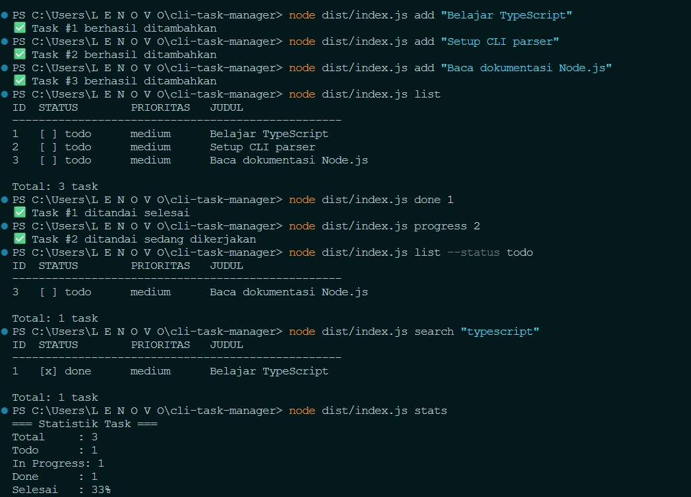
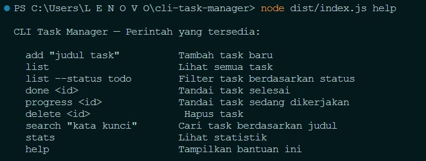

# CLI Task Manager

Aplikasi pengelola tugas berbasis command line yang dibangun dengan TypeScript.

## Fitur

- Tambah, lihat, ubah status, dan hapus task
- Filter task berdasarkan status
- Pencarian task berdasarkan kata kunci
- Statistik penyelesaian task
- Data tersimpan otomatis dalam file JSON

## Teknologi

- TypeScript 5.x
- Node.js 20 LTS
- Tanpa dependency eksternal (hanya @types/node)

## Instalasi

\`\`\`bash
git clone https://github.com/lindaangellina/cli-task-manager.git
cd cli-task-manager
npm install
npm run build
\`\`\`

## Cara Menggunakan

\`\`\`bash
node dist/index.js add "Belajar TypeScript"    # tambah task
node dist/index.js list                         # lihat semua
node dist/index.js list --status todo           # filter status
node dist/index.js done 1                       # tandai selesai
node dist/index.js progress 2                   # tandai dikerjakan
node dist/index.js delete 3                     # hapus task
node dist/index.js search "typescript"          # cari task
node dist/index.js stats                        # statistik
node dist/index.js help                         # bantuan
\`\`\`

## Struktur Project

\`\`\`
src/
├── types/
│   ├── task.types.ts        Definisi Task, TaskStatus, Priority
│   └── command.types.ts     Discriminated union Command
├── models/
│   └── Task.ts               Class TaskModel
├── repositories/
│   ├── Repository.ts         Generic repository (CRUD dasar)
│   └── TaskRepository.ts     Repository khusus Task
├── services/
│   ├── TaskService.ts        Business logic
│   └── StorageService.ts     Baca/tulis file JSON
├── cli/
│   ├── parser.ts             Parse argumen terminal jadi Command
│   ├── commands.ts           Handler untuk tiap command
│   └── display.ts            Format output ke terminal
├── utils/
│   ├── format.ts              Format tanggal
│   └── validasi.ts           Validasi input (type guard)
└── index.ts                  Entry point aplikasi
\`\`\`

## Screenshot

## Konsep TypeScript yang Digunakan

- Interface & Type Alias (Minggu 2)
- Discriminated Union untuk command parsing (Minggu 2)
- Class, Getter, Inheritance (Minggu 3-4)
- Generics — Repository Pattern (Minggu 5)
- Utility Types: Omit, Partial (Minggu 6)
- Modules & Path Alias (Minggu 7)

## Pengembang

Linda Angellina — Peserta Magang Batch 4 PT Nawasena Insan Permata